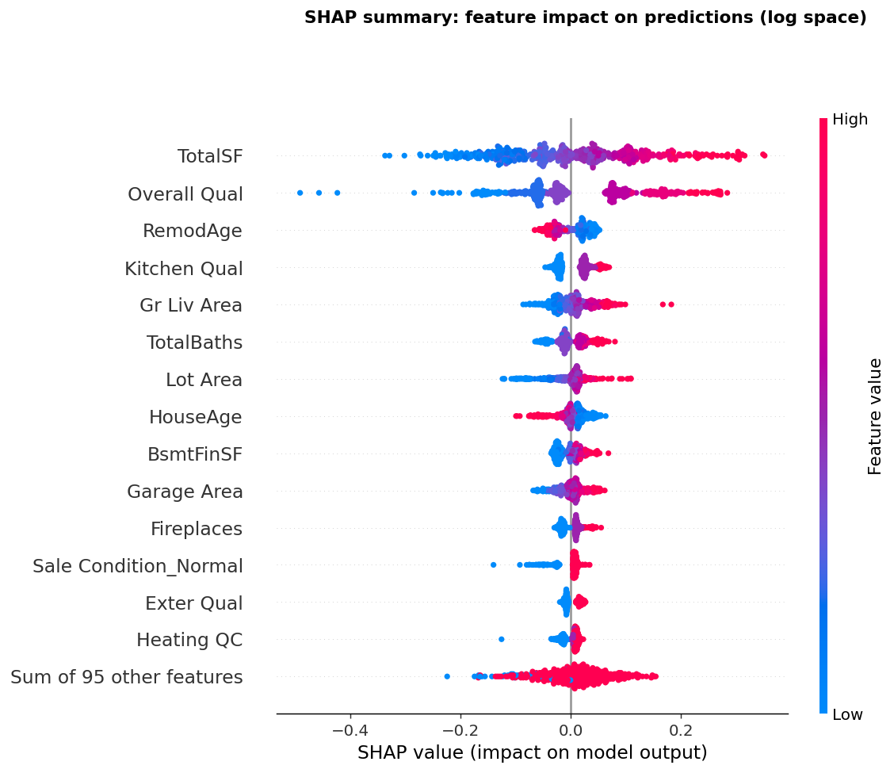

# Ames Housing Price Prediction

This is a project that uses the AMES Housing Dataset from Iowa to develop a regresion mdoel to predict house sale prices from almost 80 feautres. A complete end-to-end pipeline is developed featuring the: exploratory analysis, data cleaning, feature engineering, model training and comparison, prediction with uncertainty intervals, and a head-to-head study of a traditional model against a modern tabular foundation model(TabPFN) to see how the modern model difers on outliers and what they think each individaul feature provides more worth to the model.

Each Model is tuned with 5-fold cross-validation and compared fairly on the training data to determine which is the best one out of the batch. 

Both of the best models produce a 90% prediction interval. 

  
## Headline result

A **zero-tuning tabular foundation model (TabPFN) outperformed a fully
hyperparameter-tuned XGBoost** on this dataset, at a fraction of the effort required to engineer it. 

| Model | Test RMSE | Test MAE | MAPE | R² | Tuning required |
|---|---|---|---|---|---|
| **TabPFN** (foundation model) | **$20,806** | **$12,132** | **6.96%** | **0.946** | None |
| XGBoost (tuned) | $22,869 | $14,164 | 7.76% | 0.935 | 150-fit search |
| Random Forest (tuned) | $25,465 | $14,843 | 8.15% | 0.919 | 150-fit search |
| Ridge / Lasso | ~$31,500 | ~$16,500 | ~8.8% | ~0.87 | grid search |
| Linear Regression | $31,739 | $16,523 | 8.78% | 0.874 | none (baseline) |

*(Metrics are on a held-out 20% test split of the real data, in real dollars.)*

This is consistent with TabPFN's documented strength on small tabular datasets
(under ~10k rows), and it demonstrates an awareness of *when tuning a model one is no longer the best
answer*.


## Exploratory analysis

The full analysis lives in `notebooks/eda.ipynb`. Two findings that shaped the
whole pipeline:

**The target is right-skewed, so we train on its log.** Raw prices have a long
tail of expensive homes; taking `log1p` makes the distribution symmetric, which
makes the model optimise percentage error (what actually matters for prices)
rather than absolute dollar error.


**Location matters enormously.** Median price varies 3 to 4 times across
neighbourhoods, making `Neighborhood` one of the strongest predictors in the
dataset.


## Engineered features and encoding

The raw dataset has about 80 columns. Rather than feed them in as they are, several new
features were built, and the categorical columns were
encoded in a way that respects their meaning. 

The main engineered features:

| Feature | How it is built | Why |
|---|---|---|
| `TotalSF` | Total Bsmt SF + 1st Flr SF + 2nd Flr SF | Total living space in one strong feature; ends up the top predictor |
| `TotalBaths` | Full baths + 0.5 x half baths, all floors | One combined bathroom count, weighting half-baths sensibly |
| `TotalPorchSF` | Sum of all porch/deck area columns | Collapses several sparse columns into one |
| `BsmtFinSF` | Finished basement area | Separates finished from unfinished basement space |
| `HouseAge` | Yr Sold - Year Built | Age at sale matters to price, not the raw build year |
| `RemodAge` | Yr Sold - Year Remod/Add | Time since the last remodel |
| `Remodelled` | Flag: has the house been remodelled | Captures a renovation cleanly |
| `NearNegative` | Flag: next to a busy road or railway | Price-suppressing location factors from Condition 1 |
| `NearPositive` | Flag: next to a park or greenbelt | Price-lifting location factors from Condition 1 |
| `HasDeductions` | Flag: home has functionality deductions | Simplifies the Functional column into a single signal |

**Encoding respects whether a category is ordered.** Quality grades are *ordered*
(Excellent really is better than Good), so they are mapped to ranked integers that
preserve that order: `{None: 0, Po: 1, Fa: 2, TA: 3, Gd: 4, Ex: 5}`. Nine quality
columns share this same scale because the dataset's assessors used it
consistently. Unordered categories (like `Neighborhood` or `Garage Type`) have no
natural ranking, so they are one-hot encoded instead.

Full definitions of the original columns are in the
[Ames Housing data documentation](http://jse.amstat.org/v19n3/decock.pdf).

## Model accuracy

Both models track actual prices closely, with the scatter widening at the
high-price end where expensive houses are rarer and harder to predict.


## Model behaviour: what is each feature worth?

A set of controlled experiments (two otherwise-identical houses differing by one
feature) reveals what each model thinks a single feature adds to the price. Both
models agree on direction every time, but weight features differently: XGBoost
values a quality bump more, while TabPFN values a finished basement and a nicer
neighbourhood more.


## Model interpretability (SHAP)

XGBoost  says a house is worth $240k but gives no reason. That is a problem for trusting it, for
debugging it, and in many real settings (lending, insurance) for the legal
requirement to explain an automated decision.

Every prediction starts at the dataset average and each feature then pushes
it up or down to the final number, with SHAP measuring the size and direction of
each push. Crucially those pushes always sum exactly to the prediction, so nothing
is hidden or approximated.

This is more informative than the correlations from the EDA or XGBoost's built-in
importance, because SHAP reflects what the model *actually does* (including
feature interactions), and it works at two levels: globally, which features drive
the model overall, and locally, why one specific house was priced the way it was.



Two findings stand out. First, the features SHAP ranks as most important are
quality and size, exactly what the exploratory analysis predicted. When an
independent, rigorous method confirms the earlier hunch, it means the feature
choices were sound. Second, the single most important feature is the engineered
`TotalSF` (basement plus both floors combined), ahead of every raw column. That is
direct evidence the feature engineering added real value rather than noise.

SHAP can also explain any *individual* prediction, breaking a single house's price
down into the contribution of each feature to see exactly which features succeeded/failed to lift it.

## Prediction intervals

Predictions come with a 90% interval, not just a point estimate, so the model can
signal *how confident it is*. On real data the intervals are well-calibrated:
**89% of actual prices fell within the 90% interval**. The interval also widens
for unusual houses (e.g. a mansion with a pool, far outside the training data).

The two models produce intervals by completely different routes, which is part of
the comparison:

- **XGBoost** trains three separate models (median, 5th percentile, 95th
  percentile) using quantile loss.
- **TabPFN** produces the entire predictive distribution from a single forward
  pass, and the quantiles are read straight off it.

## Results and findings

The main takeaways from the project:

**A zero-tuning foundation model beat a fully-tuned gradient booster.** TabPFN
reached $20,806 RMSE on the held-out test set against XGBoost's $22,869, roughly
9% lower error, with no hyperparameter search at all. This is consistent with
TabPFN's known strength on small tabular datasets.

**The traditional models still show the full workflow.** Linear regression
(~$31,700 RMSE) improves through regularisation, then Random Forest ($25,465),
then tuned XGBoost ($22,869), a clean demonstration of where each modelling step
adds value. The biggest single jump is from linear models to trees, which is the
non-linearity payoff.

**The two models agree strongly but diverge in a revealing way.** Their
predictions correlate at about 0.96, so they mostly see the data the same way.
Where they part company is on the deliberate outliers: on a mansion-with-a-pool
far outside the training range, XGBoost predicted about $404k while TabPFN
predicted about $555k against a true price of $620k. TabPFN extrapolates more
gracefully beyond the data it has seen, which is a genuine difference between the
two model families.

**Both models weight features differently.** The controlled pair experiments show
both agree on direction (a fireplace, a bathroom, and central air all add value)
but not on magnitude: XGBoost values an overall quality bump most, while TabPFN
places more weight on a finished basement and a nicer neighbourhood.

**The prediction intervals are well-calibrated.** On real data, 89% of actual
prices fell inside the 90% interval, close to the ideal. The intervals also widen
for unusual houses, so the model signals its own uncertainty rather than giving a
falsely confident single number.

**SHAP confirms and deepens the EDA.** The features the exploratory analysis
flagged (quality and size) are the ones the model actually relies on most, and the
engineered `TotalSF` lands at the very top, validating the feature engineering.

**Scope note.** The exploratory analysis focuses on the highest-signal features and
the decisions they drive. A fuller analysis would extend to the remaining
categorical features, feature interactions, and the effect of the 2008 downturn
across the 2006 to 2010 sale years.

## Project structure

```
├── notebooks/
│   ├── eda.ipynb                  # exploratory analysis (the "show your work")
│   └── shap_analysis.ipynb        # interactive model interpretability
├── data/
│   ├── raw/AmesHousing.csv        # the input dataset
│   └── processed/                 # cleaned + featured data (generated)
├── models/                        # saved models + results (generated)
├── analysis/                      # charts (generated)
│
├── data_cleaning.py               # null handling, type fixes
├── feature_selection.py           # feature engineering + encoding
├── model_training.py              # train, tune, compare 4 models + intervals
├── model_training_tabpfn.py       # the TabPFN foundation-model track
├── predict.py                     # inference with intervals
├── predict_tabpfn.py              # inference, TabPFN
├── generate_test_data.py          # synthetic test houses for probing
├── compare_predictions.py         # head-to-head analysis + charts
├── explain_model.py               # SHAP interpretability + charts
└── run.py                         # runs the whole pipeline end to end
```

The pipeline is split into small, single-purpose files that each do one stage and
hand off a saved artifact to the next.

## How to run it

Requirements: Python 3.10+, with `pandas`, `scikit-learn`, `xgboost`, `joblib`,
and `matplotlib`. The TabPFN track additionally needs `tabpfn` (and benefits from
a GPU).

```bash
# Run the entire pipeline: clean -> feature -> train -> predict -> compare
python run.py
```

Optional stages are controlled by toggles at the top of `run.py`
(`RUN_TABPFN`, `RUN_TEST_DATA`, `RUN_COMPARISON`) and a `TEST_HOUSE_COUNT`
setting. Each stage can also be run on its own, for example:

```bash
python data_cleaning.py       # just the cleaning step
python model_training.py      # just training + comparison
```

## Dataset

The [Ames Housing dataset](http://jse.amstat.org/v19n3/decock.pdf) describes
2,930 residential property sales in Ames, Iowa (2006 to 2010), with 79 explanatory
features covering size, quality, location, age, and more. It is a richer, more
modern alternative to the classic Boston Housing dataset.

## Notes

- TabPFN's model weights are released under a non-commercial licence, which is
  fine for a personal portfolio but worth being aware of.
- The synthetic test set (`generate_test_data.py`) is used only to *probe model
  behaviour* on deliberate outliers and controlled experiments. It is never used
  for training or for the reported accuracy metrics, which come only from the
  held-out split of the real data.
