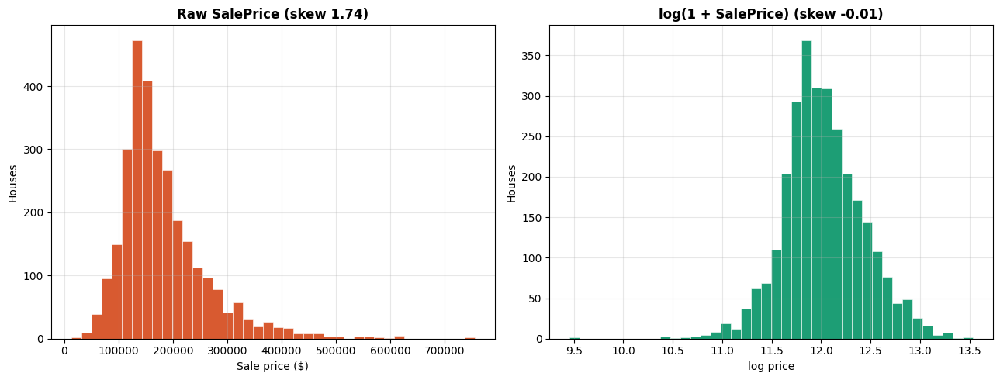
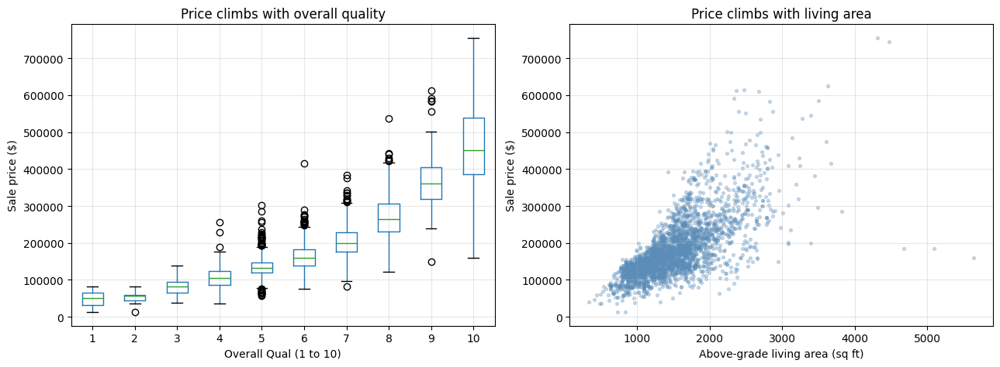
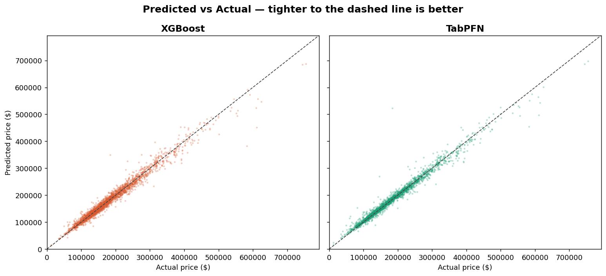
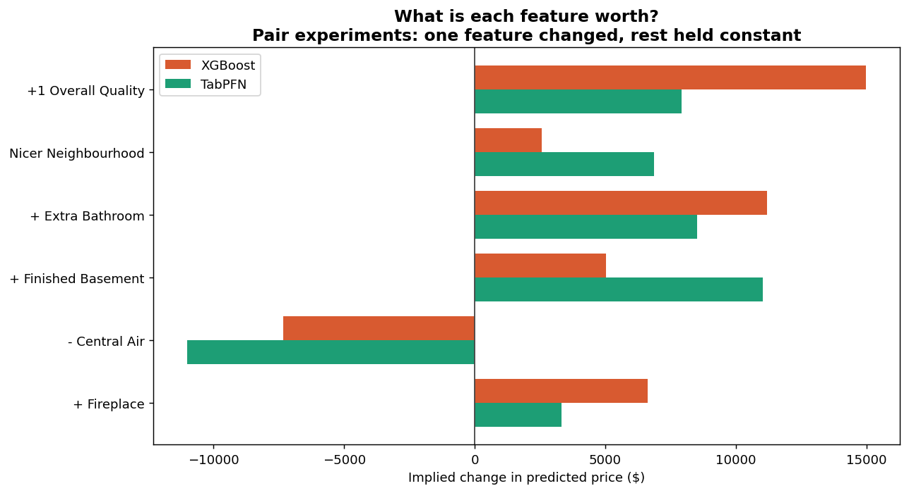

# Ames Housing Price Prediction

Predicting house sale prices from ~80 features, built as a complete end-to-end
pipeline: exploratory analysis, data cleaning, feature engineering, model
training and comparison, prediction with uncertainty intervals, and a
head-to-head study of a traditional model against a modern tabular foundation
model.

This EDA focuses on the highest-signal features and the decisions they drive; a fuller analysis 
would extend to the remaining categorical features, 
feature interactions, and temporal effects across the 2008 downturn.

## Headline result

A **zero-tuning tabular foundation model (TabPFN) outperformed a fully
hyperparameter-tuned XGBoost** on this dataset, at a fraction of the engineering
effort.

| Model | Test RMSE | Test MAE | MAPE | R² | Tuning required |
|---|---|---|---|---|---|
| **TabPFN** (foundation model) | **$20,806** | **$12,132** | **6.96%** | **0.946** | None |
| XGBoost (tuned) | $22,869 | $14,164 | 7.76% | 0.935 | 150-fit search |
| Random Forest (tuned) | $25,465 | $14,843 | 8.15% | 0.919 | 150-fit search |
| Ridge / Lasso | ~$31,500 | ~$16,500 | ~8.8% | ~0.87 | grid search |
| Linear Regression | $31,739 | $16,523 | 8.78% | 0.874 | none (baseline) |

*(Metrics are on a held-out 20% test split of the real data, in real dollars.)*

This is consistent with TabPFN's documented strength on small tabular datasets
(under ~10k rows), and it means the project demonstrates not just *how* to tune a
gradient booster, but an awareness of *when tuning one is no longer the best
answer*.

## What this project demonstrates

- **Judgement, not just code.** Every feature dropped, transformed, or
  engineered is justified by the exploratory analysis, not done by rote.
- **A real ML workflow.** Baseline → regularised → non-linear → boosted, each
  model tuned with 5-fold cross-validation and compared fairly on identical
  held-out data.
- **Deployment-minded engineering.** A prediction pipeline that reuses the exact
  training transformations (guarding against training/serving skew) and aligns
  new data to the model's expected columns so batch prediction never silently
  breaks.
- **Uncertainty quantification.** Both models produce 90% prediction intervals,
  by two very different mechanisms, and the intervals are well-calibrated on real
  data.
- **A modern comparison.** A traditional gradient booster benchmarked against a
  tabular foundation model, including how they differ on outliers and on what
  they think individual features are worth.

## Exploratory analysis

The full analysis lives in `notebooks/eda.ipynb`. Two findings that shaped the
whole pipeline:

**The target is right-skewed, so we train on its log.** Raw prices have a long
tail of expensive homes; taking `log1p` makes the distribution symmetric, which
makes the model optimise percentage error (what actually matters for prices)
rather than absolute dollar error.



**Location matters enormously.** Median price varies 3 to 4 times across
neighbourhoods, making `Neighborhood` one of the strongest predictors in the
dataset.



## Model accuracy

Both models track actual prices closely, with the scatter widening at the
high-price end where expensive houses are rarer and harder to predict.



## Model behaviour: what is each feature worth?

A set of controlled experiments (two otherwise-identical houses differing by one
feature) reveals what each model thinks a single feature adds to the price. Both
models agree on direction every time, but weight features differently: XGBoost
values a quality bump more, while TabPFN values a finished basement and a nicer
neighbourhood more.



## Prediction intervals

Predictions come with a 90% interval, not just a point estimate, so the model can
signal *how confident it is*. On real data the intervals are well-calibrated:
**89% of actual prices fell within the 90% interval**. The interval also widens
for unusual houses (e.g. a mansion with a pool, far outside the training data),
which is exactly the behaviour you want.

The two models produce intervals by completely different routes, which is part of
the comparison:

- **XGBoost** trains three separate models (median, 5th percentile, 95th
  percentile) using quantile loss.
- **TabPFN** produces the entire predictive distribution from a single forward
  pass, and the quantiles are read straight off it.

## Project structure

```
├── notebooks/
│   └── eda.ipynb                  # exploratory analysis
├── data/
│   ├── raw/AmesHousing.csv        # the input dataset
│   └── processed/                 # cleaned + featured data (generated)
├── models/                        # saved models + results (generated)
├── analysis/                      # comparison charts (generated)
│
├── data_cleaning.py               # null handling, type fixes
├── feature_selection.py           # feature engineering + encoding
├── model_training.py              # train, tune, compare 4 models + intervals
├── model_training_tabpfn.py       # the TabPFN foundation-model track
├── predict.py                     # inference with intervals
├── predict_tabpfn.py              # inference, TabPFN
├── generate_test_data.py          # synthetic test houses for probing
├── compare_predictions.py         # head-to-head analysis + charts
└── run.py                         # runs the whole pipeline end to end
```

The pipeline is split into small, single-purpose files that each do one stage and
hand off a saved artifact to the next. Scripts are used for the pipeline (they are
reproducible and automatable); a notebook is used for exploration (where its
interleaving of code, charts, and narrative fits best).

## How to run it

Requirements: Python 3.10+, with `pandas`, `scikit-learn`, `xgboost`, `joblib`,
and `matplotlib`. The TabPFN track additionally needs `tabpfn` (and benefits from
a GPU).

```bash
# Run the entire pipeline: clean -> feature -> train -> predict -> compare
python run.py
```

Optional stages are controlled by toggles at the top of `run.py`
(`RUN_TABPFN`, `RUN_TEST_DATA`, `RUN_COMPARISON`) and a `TEST_HOUSE_COUNT`
setting. Each stage can also be run on its own, for example:

```bash
python data_cleaning.py       # just the cleaning step
python model_training.py      # just training + comparison
```

## Dataset

The [Ames Housing dataset](http://jse.amstat.org/v19n3/decock.pdf) describes
2,930 residential property sales in Ames, Iowa (2006–2010), with 79 explanatory
features covering size, quality, location, age, and more. It is a richer, more
modern alternative to the classic Boston Housing dataset.

## Notes

- TabPFN's model weights are released under a non-commercial licence, which is
  fine for a personal project but worth being aware of.
- The synthetic test set (`generate_test_data.py`) is used only to *probe model
  behaviour* on deliberate outliers and controlled experiments. It is never used
  for training or for the reported accuracy metrics, which come only from the
  held-out split of the real data.
